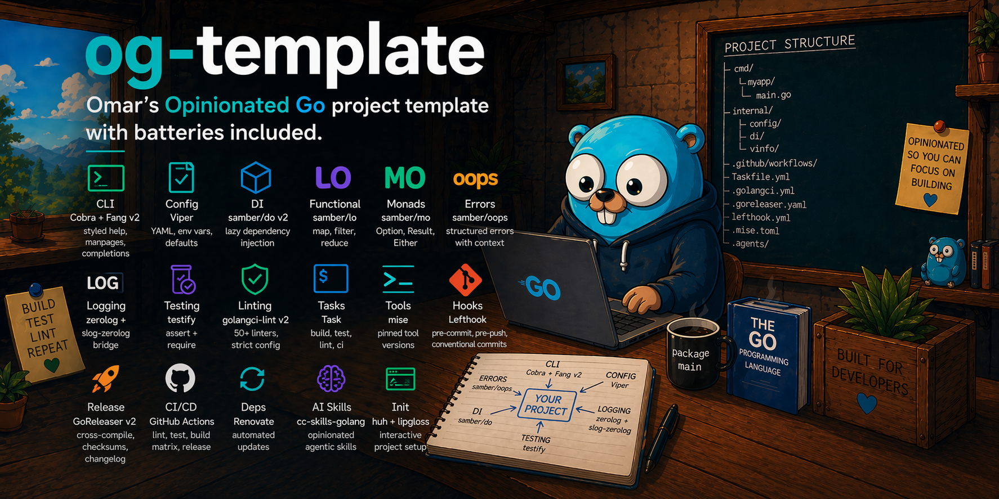

## What's Included

| Category       | Tool                                                                                                                   |
| -------------- | ---------------------------------------------------------------------------------------------------------------------- |
| **CLI**        | [Cobra](https://github.com/spf13/cobra) + [Fang v2](https://charm.land/fang) (styled help, manpages, completions)      |
| **Config**     | [Viper](https://github.com/spf13/viper) (YAML + env vars + defaults)                                                   |
| **DI**         | [samber/do v2](https://github.com/samber/do) (lazy dependency injection)                                               |
| **Functional** | [samber/lo](https://github.com/samber/lo) (map, filter, reduce)                                                        |
| **Monads**     | [samber/mo](https://github.com/samber/mo) (Option, Result, Either)                                                     |
| **Errors**     | [samber/oops](https://github.com/samber/oops) (structured errors with context)                                         |
| **Logging**    | [zerolog](https://github.com/rs/zerolog) + [slog-zerolog](https://github.com/samber/slog-zerolog) bridge               |
| **Testing**    | [testify](https://github.com/stretchr/testify) (assert + require)                                                      |
| **Linting**    | [golangci-lint v2](https://golangci-lint.run/) (50+ linters, strict config)                                            |
| **Tasks**      | [Task](https://taskfile.dev/) (build, test, lint, ci)                                                                  |
| **Tools**      | [mise](https://mise.jdx.dev/) (Go, Task, golangci-lint, lefthook versions)                                             |
| **Hooks**      | [Lefthook](https://github.com/evilmartians/lefthook) (pre-commit, pre-push, conventional commits)                      |
| **Release**    | [GoReleaser v2](https://goreleaser.com/) (cross-compile, checksums, changelog)                                         |
| **CI/CD**      | GitHub Actions (lint + test + build matrix + release)                                                                  |
| **Deps**       | [Renovate](https://docs.renovatebot.com/) (automated dependency updates)                                               |
| **AI Skills**  | [cc-skills-golang](https://github.com/samber/cc-skills-golang) (opinionated agentic coding skills in `.agents/`)       |
| **Init**       | [huh](https://charm.land/huh/v2) + [lipgloss](https://charm.land/lipgloss) (interactive project setup via `task init`) |

## Quick Start

### Use this template

Click **"Use this template"** on GitHub, then:

```bash
git clone git@github.com:yourname/yourproject.git
cd yourproject
```

### Initialize your project

Run the interactive init task to rename module, binary, and env prefix:

```bash
mise install          # Install Go, Task, golangci-lint, lefthook
task init             # Rename + deps + git hooks
task ci               # Verify everything works
```

`task init` uses [huh](https://charm.land/huh/v2) to prompt for your module path, binary name, env prefix, and which AI coding assistant harnesses to enable (`.adal`, `.augment`, `.claude`, etc.). For each selected harness, it creates symlinks from `.<harness>/skills/` into `.agents/skills/`. After setup, it rewrites all files, renames `cmd/myapp/`, runs `go mod tidy`, downloads deps, installs git hooks, and cleans up after itself (removes `cmd/init/` and the init task from `Taskfile.yml`).

## Project Structure

```
.
├── .agents/skills/       # AI coding skills (cc-skills-golang, symlinked per harness)
├── cmd/myapp/            # CLI entrypoint and commands
│   ├── main.go           #   fang.Execute with signal handling
│   ├── root.go           #   Root cobra command
│   ├── config.go         #   config show/validate commands
│   └── version.go        #   version command
├── internal/
│   ├── config/           # Viper config loading + validation
│   │   ├── config.go     #   Config struct + Validate()
│   │   └── loader.go     #   Load() returns mo.Result[*Config]
│   ├── di/               # samber/do dependency injection
│   │   ├── container.go  #   Root container with oops errors
│   │   ├── register.go   #   Service registration
│   │   ├── config_service.go
│   │   └── logger_service.go  # zerolog + slog bridge
│   └── vinfo/            # Build version metadata (ldflags)
├── .github/workflows/
│   ├── ci.yml            # Lint + test + cross-platform build
│   └── release.yml       # GoReleaser on tag push
├── Taskfile.yml          # build, test, lint, fmt, ci, clean, init
├── .golangci.yml         # 50+ linters, strict settings
├── .goreleaser.yaml      # Cross-compile + changelog + archives
├── .mise.toml            # Pinned tool versions
├── lefthook.yml          # Pre-commit, pre-push, conventional commits
└── config.example.yaml   # Example configuration
```

## Tasks

```bash
task              # List all tasks
task init         # Rename + deps + hooks (first-time only)
task build        # Build binary with ldflags
task run          # Build and run
task test         # Run tests with race detector
task test-short   # Run short tests only
task test-coverage # Tests + coverage HTML report
task lint         # golangci-lint
task fmt          # golangci-lint --fix
task ci           # fmt + lint + test + build
task deps         # Download dependencies
task tidy         # go mod tidy
task clean        # Remove all artifacts and caches
```

## Opinions & How Things Work

### CLI: Fang v2 + Cobra

The CLI uses [Cobra](https://github.com/spf13/cobra) for command structure and [Fang v2](https://charm.land/fang) as a wrapper that adds styled help pages, automatic `--version` flag, manpage generation via a hidden `man` subcommand, and shell completions out of the box.

Entry point (`cmd/myapp/main.go`):

- Sets up signal handling (`SIGINT`, `SIGTERM`)
- Calls `fang.Execute()` which wraps the root Cobra command
- Returns exit code 1 on error, 0 on success

### Configuration: Viper + mo.Result

Configuration loads from multiple sources with this precedence:

1. `--config` CLI flag (explicit path)
2. Environment variables prefixed with `MYAPP_` (e.g. `MYAPP_APP_NAME`, `MYAPP_LOGGING_LEVEL`)
3. `config.yaml` in the current directory
4. `$HOME/.config/myapp/config.yaml`
5. Built-in defaults (development mode, info logging, pretty format)

The loader returns `mo.Result[*Config]` for monadic error handling. Config is validated after loading — invalid values produce clear error messages.

```bash
myapp config show       # Display all resolved config values
myapp config validate   # Check config is valid
```

### Dependency Injection: samber/do v2

Services are registered lazily in `internal/di/register.go` and resolved on first use. The container pattern:

1. `NewContainer(configPath)` creates the root injector
2. `RegisterServices()` registers all providers (config, logger, etc.)
3. Services resolve dependencies via `do.MustInvoke[T](injector)` in their constructors
4. `ShutdownWithContext()` tears down all services gracefully

To add a new service: create it in `internal/yourpkg/`, register with `do.Provide(injector, NewYourService)` in `register.go`.

### Error Handling: samber/oops

Errors use `samber/oops` for structured context throughout the DI and config layers:

```go
return nil, oops.
    In("config").           // domain
    Code("invalid_config"). // machine-readable code
    Wrapf(err, "load configuration")
```

This gives you stack traces, domain context, and error codes without losing the original error chain.

### Logging: zerolog + slog Bridge

The logger service creates a `zerolog.Logger` and bridges it to Go's `slog` via `samber/slog-zerolog`. This means:

- Use `slog` in application code (stdlib, portable)
- Get zerolog's performance and structured output under the hood
- Pretty console output in development, JSON in production
- Controlled via `logging.level` (debug/info/warn/error) and `logging.format` (pretty/json)

### Functional Utilities: samber/lo + samber/mo

- **lo**: Generic slice/map operations — `lo.Map`, `lo.Filter`, `lo.SliceToMap`, `lo.MaxBy`, `lo.Uniq`, etc.
- **mo**: Monadic types — `mo.Option[T]`, `mo.Result[T]`, `mo.Either[L, R]`. Config loading returns `mo.Result` for composable error handling.

### Git Hooks: Lefthook

Three hooks are installed via `lefthook install`:

**pre-commit** (runs in parallel):

- `golangci-lint run --fix` on staged `.go` files (auto-stages fixes)
- `task test-short` for fast feedback

**pre-push**:

- `task test` (full test suite with race detector)
- `task build` (ensures the binary compiles)

**commit-msg**:

- Enforces [Conventional Commits](https://www.conventionalcommits.org/) format
- Valid types: `feat`, `fix`, `docs`, `style`, `refactor`, `perf`, `test`, `chore`, `ci`, `build`
- Format: `type(scope?): subject`
- Examples: `feat: add user auth`, `fix(config): handle missing file`, `chore: bump deps`

Hooks skip on merge and rebase to avoid friction.

### Linting: golangci-lint v2

The `.golangci.yml` enables 50+ linters with strict settings and **no exclusions on test files**:

| Setting                          | Value                 | Why                         |
| -------------------------------- | --------------------- | --------------------------- |
| `gocyclo.min-complexity`         | 10                    | Keep functions simple       |
| `gocognit.min-complexity`        | 15                    | Enforce readability         |
| `funlen.lines`                   | 80                    | Short functions             |
| `funlen.statements`              | 50                    | Short functions             |
| `lll.line-length`                | 120                   | Reasonable line width       |
| `dupl.threshold`                 | 100                   | Catch copy-paste            |
| `errcheck.check-type-assertions` | true                  | No unchecked type casts     |
| `errcheck.check-blank`           | true                  | No `_ = err`                |
| `exhaustruct`                    | project packages only | Catch missing struct fields |

Only protobuf (`.pb.go`) and generated (`_generated.go`) files are excluded.

### Build: ldflags Version Injection

`task build` injects version metadata via `-ldflags`:

- `Version` — from `git describe --tags --always --dirty`
- `Commit` — from `git rev-parse --short HEAD`
- `BuildDate` — UTC timestamp

The `internal/vinfo` package exposes `String()` which formats these for `--version` output. Falls back to `debug.ReadBuildInfo()` for `go install` builds.

### CI/CD: GitHub Actions

**CI** (`.github/workflows/ci.yml`):

- Triggers on push/PR to main/master
- Runs golangci-lint via official action
- Runs tests with coverage (uploads to Codecov)
- Cross-compiles build matrix: linux/darwin/windows × amd64/arm64
- Uses `go-version-file: go.mod` (always matches local Go version)
- Concurrency groups cancel superseded runs

**Release** (`.github/workflows/release.yml`):

- Triggers on `v*.*.*` tag push
- Runs GoReleaser v2 to build, archive, generate changelog, and publish GitHub release

### Release: GoReleaser v2

`goreleaser` builds for linux/darwin/windows (amd64 + arm64), creates tar.gz archives (zip for Windows), generates SHA-256 checksums, and publishes a GitHub release with a conventional-commit-based changelog grouped by type (features, fixes, performance).

```bash
git tag v0.1.0
git push origin v0.1.0  # Triggers release workflow
```

### Tool Versions: mise

All tool versions are pinned in `.mise.toml`:

- **Go** — pinned to specific patch version
- **Task** — pinned
- **golangci-lint** — pinned
- **lefthook** — pinned

Run `mise install` to get the exact versions. No global installs needed.

### Local Caches

Build caches are kept per-project (not in `$HOME`) for isolation:

- `.gocache/` — Go build cache
- `.gomodcache/` — Go module cache
- `.tmp/` — golangci-lint cache, temp files

All are gitignored. `task clean` removes everything.

### Dependency Updates: Renovate

Renovate is pre-configured with `config:recommended`. Once enabled on your GitHub repo, it will automatically open PRs for dependency updates in `go.mod`.

### AI Coding Skills

The `.agents/skills/` directory contains [cc-skills-golang](https://github.com/samber/cc-skills-golang) — a curated set of agentic coding skills for AI assistants working in Go codebases. These provide opinionated guidance for code generation, testing patterns, and project conventions.

`.agents/skills/` is the single source of truth. At `task init`, you pick which AI coding assistants you use and the init tool creates `.<harness>/skills/` symlink directories pointing into `.agents/skills/`. Supported harnesses include `.adal`, `.augment`, `.claude`, `.codebuddy`, `.continue`, `.cortex`, `.crush`, `.factory`, `.goose`, `.iflow`, `.junie`, `.kilocode`, `.kiro`, `.kode`, `.openhands`, `.qoder`, `.qwen`, `.roo`, `.trae`, `.windsurf`, `.zencoder`, and more.

## License

MIT
